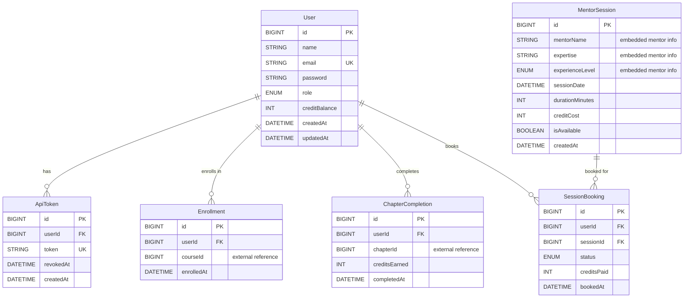

# Test Project Outline – Module A – REST API

## Competition time

Competitors will have **3 hours** to complete module A.

## Introduction

Module A will focus on the implementation of a REST API.

## General Description of Project and Tasks

Competitors will be asked to create a REST API for the SkillShare Academy learning platform. The API must be built with features that make it available publicly. The main goal of this backend is to serve the frontend, which will be used by learners to sign up for courses, learn, and attend mentoring sessions.

The content service runs as a separate service and is not publicly accessible, as it lacks security and reliability. The code of the service will not be disclosed; instead, an OpenAPI specification and documentation will be provided.

In your backend, you must build code that wraps these APIs and exposes them through a single unified API on top of the user, credit, and mentor session management APIs.

A specification in OpenAPI format describes the required endpoints, authentication, and other requirements.

## Requirements

The API shall be implemented using one of the provided frameworks.

### Data Model

- The backend uses a **MySQL** database for data storage.
- It can be accessed at `db.ssa.skillsit.hu`, using port `3306` with the provided credentials.
- The database name follows the format: `cXX_module-a`, where `XX` is your workstation number.

The database is currently empty. Use the given SQL dump in [`assets/module-a/db/skillshare_academy.sql`](./assets/module-a/db/skillshare_academy.sql) to import the data. Please do not modify the given tables and data; however, you may extend the database schema to store additional data.



PHPMyAdmin is also available at `pma.ssa.skillsit.hu`.

**Provide a database SQL dump of the schema and data** that you are using in the `db/db-dump.sql` file in your solution repository.

### External Content Service

The external content service is accessible to your REST API server in a private network without authentication, but it is not accessible to the public at all.

**Content Service URL:** `https://content.ssa.skillsit.hu`

You can find the OpenAPI documentation for this service here: [`assets/module-a/api/content-service-api.yaml`](./assets/module-a/api/content-service-api.yaml)

### Error Handling

There are several types of errors that can occur. The API endpoints must handle these errors and return the appropriate HTTP status code. The API endpoints must also return a JSON object with an error message.

Errors:

- `400` Bad Request: The request is malformed. This error shall be returned if the request is malformed or if the request is missing required fields.
- `401` Unauthorized: The user is not authorized to make the request. This error shall be returned if the token is invalid.
- `403` Forbidden: The user is not allowed to make the request. This error shall be returned if the credit limit is exceeded.
- `404` Not Found: The requested resource was not found. This error shall be returned if the requested course, session, or booking was not found.
- `503` Service Unavailable: The service is not available. This error shall be returned if the learning service is not available or if the learning service returns an unexpected error.

### Endpoints to be implemented on the backend

#### General rules for the API

- Port: 80
- The response bodies contain some static example data. Dynamic data from the database should be used.
- Placeholder parameters in the URL are marked with a preceding colon _(e.g :slug)_
- The order of properties in objects does not matter, but the order in an array does.
- The `Content-Type` header of a response is always `application/json` unless specified otherwise.
- The given URLs are relative to the base URL of the API: `/api/v1`.
- All endpoints require endpoints must require an API token to be passed in the `X-API-TOKEN` header, except for the following:
  - POST `/users/register`
  - POST `/users/login`

- In case of a missing or invalid token, the backend should return a `401 Unauthorized` response:

**Response:** 401 Unauthorized

```json
{
  "message": "Invalid token"
}
```

- Pay attention to the defined HTTP status codes. The backend should return the correct status code for each endpoint.
- Implement the error handling as described in the API documentation. The backend should return the correct error message and status code for each endpoint.

A specification in OpenAPI format describes the required endpoints, authentication, and other requirements:
[`assets/module-a/api/skillshare-academy-api.yaml`](./assets/module-a/api/skillshare-academy-api.yaml)

#### User Management API

##### POST /users/register

Register a new user. New users have 0 credits by default. An email address must be unique.

**Request Body:**

```json
{
  "email": "user@example.com",
  "password": "password123",
  "name": "John Doe"
}
```

**Response (on success):** 201 Created

```json
{
  "message": "User created successfully",
  "user": {
    "id": 1,
    "email": "user@example.com",
    "name": "John Doe",
    "credits": 0
  }
}
```

**Response (if email is already taken):** 400 Bad Request

```json
{
  "message": "Failed to register user"
}
```

---

#### POST /users/login

Log in with email and password.

**Request Body:**

```json
{
  "email": "user@example.com",
  "password": "password123"
}
```

**Response (on success):** 200 OK

```json
{
  "message": "Login successful",
  "user": {
    "id": 5,
    "name": "Eva Rodriguez",
    "email": "eva@example.com",
    "credits": 170
  },
  "token": "eva_token_321654987cbafed"
}
```

Note: You have flexibility in token generation - any secure method (UUID, custom algorithm, etc.) is acceptable for creating authentication tokens.

**Response (on failure):** 401 Unauthorized

```json
{
  "message": "Invalid email or password"
}
```

---

#### POST /users/logout

Log out the current user. Sets the `revoked_at` field of the user's token to the current time. **If the token is invalid or already revoked, it should return the generic 401 Unauthorized error defined above.**

**Response (on success):** 200 OK

```json
{
  "message": "Logout successful"
}
```

---

##### GET /users/me

Get user profile information, statistics, progress data, and recent activity feed.

**Response:** 200 OK

```json
{
  "user": {
    "id": 5,
    "name": "Eva Rodriguez",
    "email": "eva@example.com",
    "creditBalance": 89
  },
  "stats": {
    "enrolledCourses": 3,
    "completedChapters": 13,
    "totalCreditsEarned": 52,
    "upcomingBookings": 1
  },
  "recentActivity": [
    {
      "type": "chapter_completed",
      "description": "Completed chapter 3",
      "creditsEarned": 5,
      "timestamp": "2025-01-11T18:00:00.000Z"
    },
    {
      "type": "session_booked",
      "description": "Booked session with Sarah Johnson",
      "creditsPaid": 15,
      "timestamp": "2025-08-18T11:00:00.000Z"
    },
    {
      "type": "chapter_completed",
      "description": "Completed chapter 7",
      "creditsEarned": 4,
      "timestamp": "2025-01-10T14:30:00.000Z"
    },
    {
      "type": "session_booked",
      "description": "Booked session with Michael Brown",
      "creditsPaid": 14,
      "timestamp": "2025-01-09T09:15:00.000Z"
    },
    {
      "type": "chapter_completed",
      "description": "Completed chapter 2",
      "creditsEarned": 4,
      "timestamp": "2025-01-08T16:45:00.000Z"
    }
  ],
  "sessions": [
    {
      "id": 1,
      "session": {
        "id": 1,
        "mentorName": "Sarah Johnson",
        "expertise": "Frontend Development",
        "experienceLevel": "senior",
        "sessionDate": "2026-02-26T07:00:00.000Z",
        "durationMinutes": 60
      },
      "status": "completed",
      "creditsPaid": 15,
      "bookedAt": "2026-02-10T08:00:00.000Z"
    }
  ]
}
```

**Recent Activity Details:**

- **Type:** `chapter_completed` - When the user completes a course chapter
- **Type:** `session_booked` - When a user books a mentoring session
- **Description:** Human-readable activity description
- **Credits:** `creditsEarned` (for completions) or `creditsPaid` (for bookings)
- **Timestamp:** ISO 8601 formatted timestamp
- **Limit:** Returns up to 5 most recent activities, sorted by timestamp (newest first)

#### Course Management API

##### GET /courses

Get a list of all available courses with user enrollment status.

**Response:** 200 OK

```json
{
  "courses": [
    {
      "id": 1,
      "title": "Web Development Fundamentals",
      "description": "Learn the basics of HTML, CSS, and JavaScript",
      "difficulty": "beginner",
      "totalChapters": 6,
      "totalCredits": 26,
      "isEnrolled": true
    },
    {
      "id": 2,
      "title": "Advanced React Development",
      "description": "Master React hooks, context, and advanced patterns",
      "difficulty": "advanced",
      "totalChapters": 5,
      "totalCredits": 24,
      "isEnrolled": false
    }
  ]
}
```

---

##### GET /courses/:id

Get detailed information about a specific course with chapter details.

**Response:** 200 OK

```json
{
  "course": {
    "id": 1,
    "title": "Web Development Fundamentals",
    "description": "Learn the basics of HTML, CSS, and JavaScript",
    "difficulty": "beginner",
    "totalChapters": 6,
    "totalCredits": 26,
    "isEnrolled": true,
    "chapters": [
      {
        "id": 1,
        "title": "HTML Structure and Semantics",
        "description": "Learn proper HTML document structure",
        "credits": 4,
        "isCompleted": true
      },
      {
        "id": 2,
        "title": "CSS Styling and Layout",
        "description": "Master CSS selectors and layout techniques",
        "credits": 4,
        "isCompleted": false
      }
    ]
  }
}
```

**Response (if course not found):** 404 Not Found

```json
{
  "message": "Course not found"
}
```

---

##### POST /courses/:id/enroll

Enroll the current user in a course.

**Response (on success):** 200 OK

```json
{
  "message": "Successfully enrolled in course"
}
```

**Response (if already enrolled):** 409 Conflict

```json
{
  "message": "Already enrolled in this course"
}
```

**Response (if course not found):** 404 Not Found

```json
{
  "message": "Course not found"
}
```

---

##### POST /courses/:courseId/chapters/:chapterId/complete

Mark a chapter as completed and earn credits.

**Response (on success):** 200 OK

```json
{
  "message": "Chapter completed",
  "creditsEarned": 5,
  "newBalance": 50
}
```

**Response (if not enrolled):** 403 Forbidden

```json
{
  "message": "Not enrolled in this course"
}
```

**Response (if already completed):** 409 Conflict

```json
{
  "message": "Chapter already completed"
}
```

---

#### Mentor Session API

##### GET /mentors/sessions

Get available mentor sessions.

**Response:** 200 OK

```json
{
  "sessions": [
    {
      "id": 6,
      "mentorName": "Sarah Johnson",
      "expertise": "Frontend Development",
      "experienceLevel": "senior",
      "sessionDate": "2025-08-19T14:00:00.000Z",
      "durationMinutes": 60,
      "creditCost": 15,
      "isAvailable": true
    },
    {
      "id": 7,
      "mentorName": "Michael Brown",
      "expertise": "Backend Development",
      "experienceLevel": "senior",
      "sessionDate": "2025-08-20T10:00:00.000Z",
      "durationMinutes": 60,
      "creditCost": 14,
      "isAvailable": true
    }
  ]
}
```

---

##### POST /mentors/sessions/:id/book

Book a mentor session.

**Response (on success):** 200 OK

```json
{
  "message": "Session booked successfully",
  "booking": {
    "id": 7,
    "sessionId": 6,
    "status": "pending",
    "creditsPaid": 15,
    "bookedAt": "2025-08-18T11:00:00.000Z"
  }
}
```

**Response (if insufficient credits):** 403 Forbidden

```json
{
  "message": "Insufficient credits"
}
```

**Response (if session not available):** 409 Conflict

```json
{
  "message": "Session not available"
}
```

## Assessment

Module A will be assessed using tools that directly access the API created by competitors. The API will be tested for its functionality and its adherence to the specification. The API will also be tested for its security and reliability.
