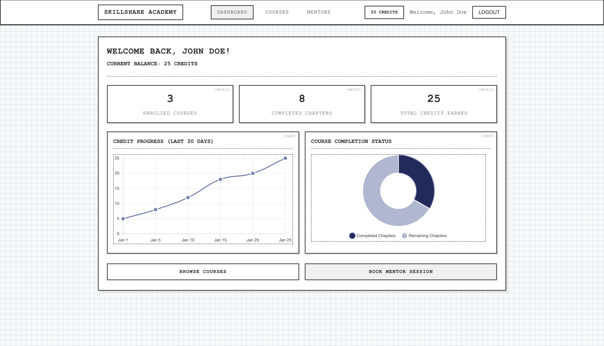

# Test Project Outline – Module B – Frontend

## Competition time

Competitors will have **3 hours** to complete module D.

## Introduction

Module B will focus on the implementation of a frontend for a REST API.

## General Description of Project and Tasks

The competitors will be asked to create a frontend for a REST API. First, users of that frontend will need to log in. Using the authentication mechanism of the API, the frontend will then be able to access the API and send as well as retrieve data from it. The functionality created by competitors in this module builds on top of the functionality created in module A.

Competitors will be given a working solution of Module A at the start of Module B, which they must use. Competitors are not allowed to build on top of their own Module B solution.

**Base URL of the provided backend:** `https://cXX-solution.ssa.skillsit.hu/api/v1` where `XX` is the competitor's station number.

**API Documentation:** OpenAPI documentation is available in the `assets` for this backend and serves as the reference for all API endpoints.

**Database:** Competitors do not have direct access to the database that the provided backend uses. However, a database dump is available in the `assets/db` directory for competitors to examine the data structure and content. All user passwords are set to **`password123`**.

The users of the frontend will be able to discover available courses, enroll in learning paths, complete chapters to earn credits, and book mentorship sessions. The frontend must handle the complexity of the credit system, real-time booking confirmations, and data visualization while presenting an intuitive interface to users.

Initially the application requires user authentication. Users must log in to access the learning platform features. The X-API token must be sent to the server with every request and stored in the browser for persistence across page reloads and navigation.

You must implement the frontend using a framework. It is possible to use additional libraries. The application must be a Single Page Application (SPA). The routing must be handled by the framework. Page reloads must present the same content to the user as previously visible, except unsaved user driven inputs.

## Requirements

The goal of this frontend is to provide learners with an intuitive interface to interact with the SkillShare Academy platform through a REST API. Users must be able to authenticate, discover courses, complete learning chapters, earn credits, and book mentor sessions seamlessly.

The frontend must implement the following functional requirements:

- Single Page Application (SPA) architecture using a modern JavaScript framework
- Authentication system using X-API tokens from Module A API
- Integration with provided Module A API solution
- Error handling for various HTTP status codes
- Local storage for authentication token persistence
- Data polling for real-time booking status updates

### Design Guidelines

Wireframes for each page are provided in the `assets/` directory. Your implementation should:

- Follow the layout structure and component placement shown in the wireframes
- Ensure responsive design principles are followed across all screen sizes
- Use modern UI/UX practices while respecting the established design framework

### Error Handling

The API can return various errors during operation. The frontend must handle these errors and display them to the user in a comprehensible way. The following errors must be handled:

- `400 Bad Request` – The request was malformed. The user must be notified that they have entered invalid data.
- `401 Unauthorized` – The authentication token is invalid or expired. The user must be redirected to the login page.
- `403 Forbidden` – The user lacks permission for the requested action. The user must be notified of insufficient permissions.
- `404 Not Found` – The requested resource was not found. The user must be notified that the content is unavailable.
- `422 Unprocessable Entity` – Validation errors occurred. Display specific field errors to guide user corrections.
- `500 Internal Server Error` – Server error occurred. The user must be notified of a temporary system issue.

### Pages

The following pages must be implemented:

#### Login Page

The login page allows users to authenticate with the SkillShare Academy platform. If the user is not logged in, they will be automatically navigated to this page.

The page must contain the following elements:

- An email input field for the user to enter their email address.
- A password input field for the user to enter their password.
- A login button to authenticate the user.
- A link to the registration page for users who do not yet have an account.
- Form validation with real-time feedback for invalid inputs.

Upon successful authentication, the X-API token must be stored in localStorage and the user redirected to the User Dashboard.

#### Registration Page

The registration page allows new users to create free accounts on the platform.

The page must contain the following elements:

- A name input field for the user's full name.
- An email input field for the user's email address.
- A password input field with strength validation.
- A confirm password field that must match the password.
- A registration button to create the account.
- A link back to the login page.
- Text explaining that registration is free.

Form validation must include email format checking, password strength requirements, and matching password confirmation. After successful registration, the user must be redirected back to the login page.

#### User Dashboard

The dashboard serves as the main landing page after login, displaying user statistics and learning analytics.

The page must contain the following elements:

- A welcome message with the user's name.
- Current credit balance prominently displayed.
- Credit earning progress chart (line chart) showing credit accumulation over the last 30 days.
- Course completion status chart (doughnut chart) showing completed vs. remaining chapters across all enrolled courses.
- Navigation links to Course Catalog and Mentor Booking pages.
- Quick statistics display showing total enrolled courses and completed chapters.

**The charts do not need to be implemented yet, please use a placeholder image instead.**

#### Course Catalog

The course catalog displays all available courses with enrollment status indicators.

The page must contain the following elements:

- Course cards displaying: title, description, difficulty level, total chapters, total credits available.
- For each course card, enrollment status must be clearly indicated:
  - If the user is **not enrolled**: Display an "Enroll" button that triggers immediate enrollment.
  - If the user is **enrolled**: Display a "Continue Learning" button that navigates to the course page.
- Search functionality to filter courses by title or description.
- Filter options for difficulty level (Beginner, Intermediate, Advanced).
- Visual indicators showing enrollment status for each course.

Course enrollment must provide immediate visual feedback and update the button state.

#### Course Page

Individual course pages display detailed progress and chapter management for enrolled courses.

##### Course Header

- Course title and description
- Visual progress indicator showing completed chapters out of total chapters
- Credit progress indicator showing earned credits out of possible total credits

##### Chapter Management

Complete listing of all course chapters with the following information for each:

- Chapter title and short description
- Credit value (3-5 credits per chapter)
- Completion status with appropriate actions:
  - **If not completed**: "Mark as Completed" button that adds credits to user's account when clicked
  - **If completed**: "Chapter Completed" label and "Share Achievement" button for LinkedIn sharing
- A "View Chapter" button that displays as disabled/inactive to represent future functionality. Competitors should style this button to clearly indicate it is not functional (e.g., grayed out, with disabled cursor)

##### Chapter Completion Behavior

When a user marks a chapter as completed:

- Credits must be immediately added to their account
- The "Mark as Completed" button must be replaced with a completion label and LinkedIn share button
- Progress indicators must update to reflect the new completion status

##### LinkedIn Share Integration

- Place a button for LinkedIn sharing. This does not have to work right now, later this functionality will be added.

#### Mentor Session Booking Page

The mentor session booking page displays available future mentor sessions that users can book and track booking confirmations.

The page must contain the following elements:

- List of available mentor sessions with the following information for each session:
  - Mentor name and key information (expertise areas, experience level).
  - A "View Profile" button that displays as disabled/inactive to represent future functionality. Competitors should style this button to clearly indicate it is not functional (e.g., grayed out, with disabled cursor).
  - Session date and time.
  - Session duration (always one hour).
  - Credit cost for the session based on mentor's hourly rate (8-15 credits/hour).
  - "Book Session" button to submit the booking request.
- After booking submission, sessions must show "Pending Confirmation" status.
- Real-time polling every 30 seconds to check for mentor responses.
- Status updates when bookings change from "pending" to "confirmed" or "rejected".
- Visual notifications when booking status changes occur.
- List of user's booked sessions showing status, mentor, date/time, and cost.

The booking confirmation system must handle mentor responses and provide immediate visual feedback to users. Poll mentor session confirmations every 30 seconds after booking submission. Update UI when bookings change from "pending" to "confirmed" or "rejected".

## Assessment

Module B will be assessed using the provided version of Google Chrome. The assessment will include functional tests, as well as user experience.

**Important**: Any modifications to the provided Module A API solution, including any changes to the database will not be considered during assessment. Use only the provided API endpoints as-is.
